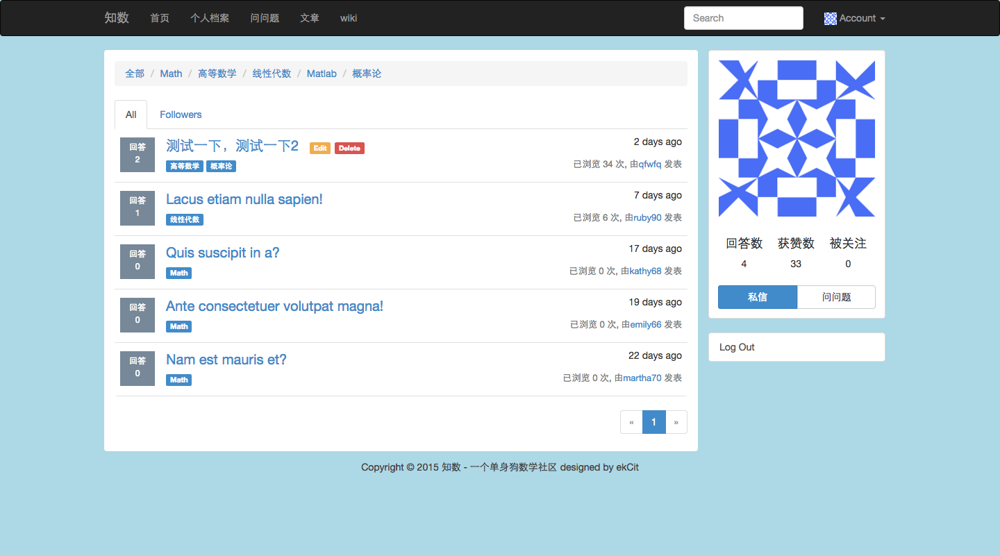

.. _getting_started:

***************
运行环境搭建
***************

.. _installing-env:

安装 python2.7 与 virtualenv
=============================

装python2.7

https://www.python.org/

::

    pip install virtualenv

这样就装完了

切换python环境
=============================

进入工程目录

linux：

::

    source env/bin/activate

windows：

先把 ENV 删了

::
    
    virtualenv env
    env\bin\activate
    pip install requirements\prod.txt

启动服务器
=============================

::

    python manage.py runserver

然后打开浏览器访问 127.0.0.1:5000

需要翻个墙，有些cdn我不知道是不是隔在墙外面，头像在墙外。

这张图没清cookie，你进去后先注册一下

