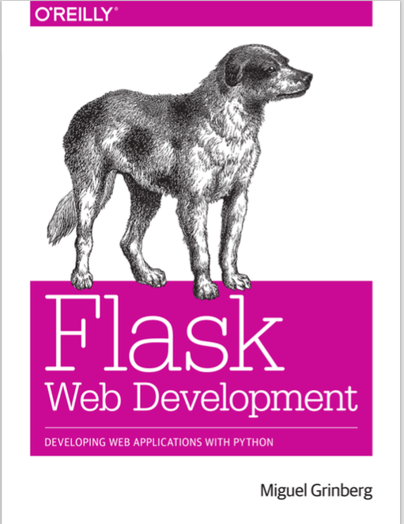

.. 知数 documentation master file, created by
   sphinx-quickstart on Sat Dec 12 16:02:29 2015.
   You can adapt this file completely to your liking, but it should at least
   contain the root `toctree` directive.

知数(问答网站)说明
================================

知数的定位是一个单身狗数学社区，它的优点在于禁止用户发布情感类问题（然而并没有写这个功能，所以是人工的！）

。。。。。

它就是一个普通问答网站。

完成了一般问答网站的如下功能：

+ 发布问题
+ 回答问题
+ 支持标签
+ 支持关注
+ 支持点赞和反对
+ 支持Markdown&Latex，编辑器实时显示编辑效果

代码在这里：

https://github.com/crosick/zhishu

至于导航里文章和wiki都是摆设而已。做完了一定能改变世界hahahahahaha－ －,我不吐槽几下怕是文档写不完－ －。

这里感谢一下这本书。
书中实现了一个微博系统。我写这个问答系统也是照着这本书顺下来的。

等我发达的时候，一定买正版书支持作者与出版行业。

如果职场没有性别歧视的话。

啊哈哈。

不自嘲一下我怕文档写不下去啊－ －，这事又没有报酬，做着很容易让人怀疑人生意义的。

书的封面也是只单身狗耶！

环境搭建及运行
================================

.. toctree::
   :maxdepth: 2

   get_started.rst

设计文档
================================

看设计文档前过一遍 flask框架入门 
http://flask.pocoo.org/ 虽然没人会看。

.. toctree::
   :maxdepth: 2

   design.rst
   

测试方法
================================
 
单元测试只要一句命令。
测试数据模型基本操作，以及测试注册登录功能。

::

   python manage.py test

或者自由地使用这个网站，反正就那么几个功能。

